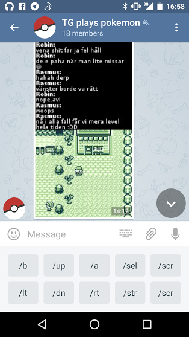

# tgameboy

silly gameboy telegram bot, taking spam on telegram to whole new levels

## setup

first create a new telegram bot with the `BotFather` telegram user. store your
token somewhere temporarily. then:

    npm install
    cp tgameboy-token.js.example ~/.tgameboy-token.js
    $EDITOR ~/.tgameboy-token.js
    node index.js <path-to-rom>.gb

## screenshot

## TODO

* chat in game screenshot
* rate limiting per room
